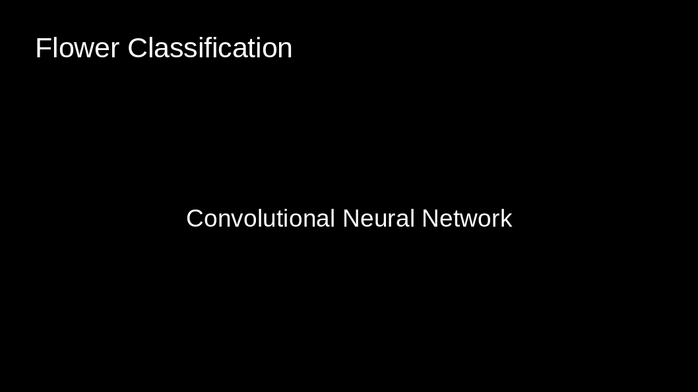
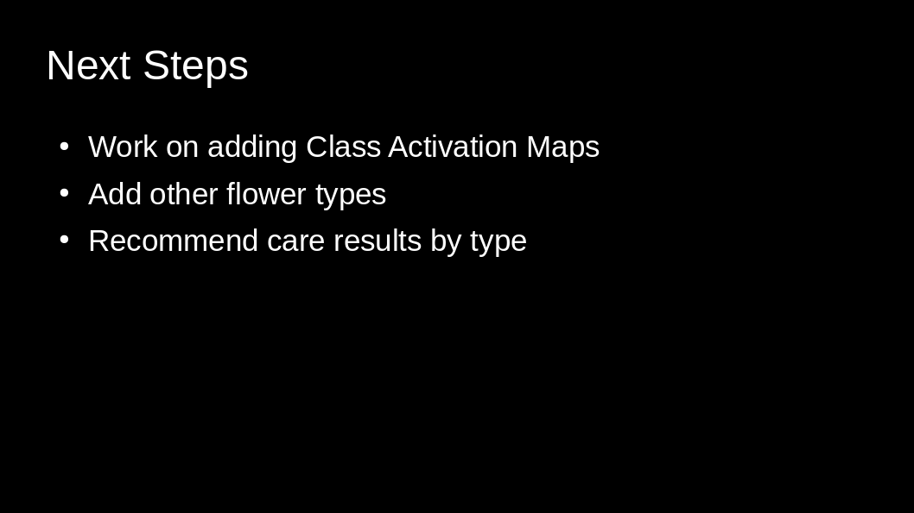

# Capstone2
Often when out in public with my parents we come across flowers or plants that my Mother sees and wants to know what they are so she can try to get some for her garden. Because of this I decided to do a flower based image classification convolutional neural network for my Capstone 2 project.

The link to the image dataset used to train the model is below

https://www.kaggle.com/alxmamaev/flowers-recognition

I let the model run overnight without any stopping conditions but saving only the best weights.

